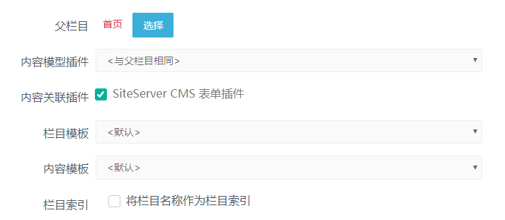
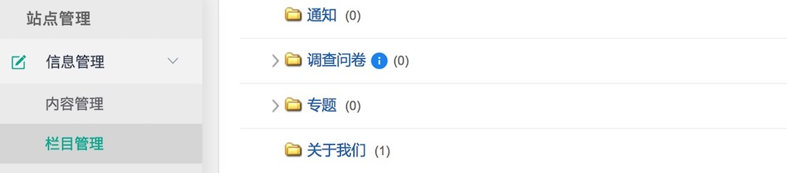
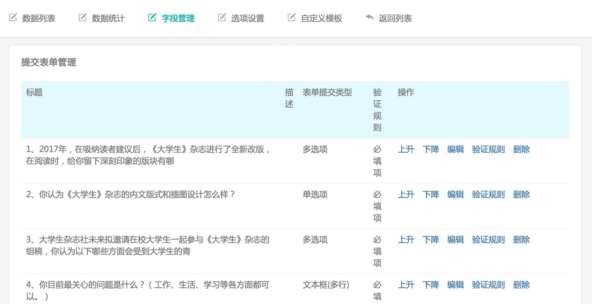

# 表单插件概述

后台管理自定义提交表单在模板中调用展示到前台，前台用户使用提交表单提交数据到后台。

### 1、表单插件使用

* 插件安装成功之后，在栏目管理中可以设置栏目的内容关联插件为表单插件，



* 栏目添加成功会看到带有蓝色小图标的栏目就是提交表单栏目了



* 调查问卷栏目中添加内容，添加后会看到表单管理


* 点击表单管理会看到表单管理功能项



在这可以进行表单字段的设置，表单前台页面展示样式的设置、前台表单提交的数据明细与统计等功能；

### 2、模板中调用标签

在内容页调用表单只需要一个简单的表单标签即可，代码如下所示：

```
<stl:form></stl:form>

```

如果是在栏目页或首页调用表单，需要指定具体的表单名称。

