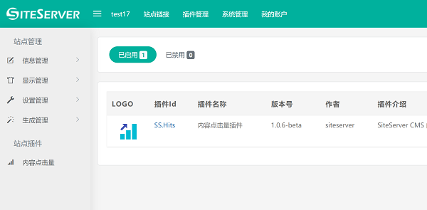
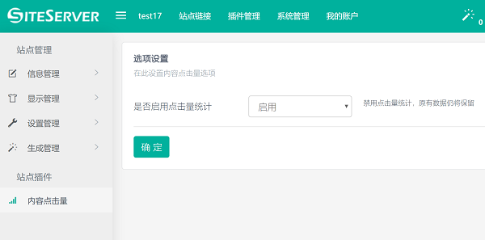
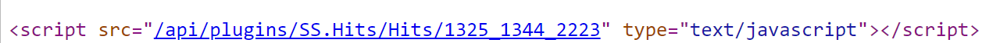

# 开始使用表单插件

本指南介绍 SiteServer CMS 表单插件，需要基本的 SiteServer 管理知识。本教程将介绍如何安装表单插件，创建表单，在页面上显示表单，以及如何自定义表单。

## 安装表单插件

安装表单插件需要进入 SiteServer CMS 管理后台，点击菜单"插件管理" -> "添加插件"，进入插件列表。在列表中找到**自定义表单插件SS.Form**，在插件页面中点击安装。

插件安装完毕后将在管理后台左侧菜单中出现表单功能，表示表单插件已经成功安装完成。



## 显示表单

让我们从在页面上显示表单开始。首先，在 SiteServer CMS 管理后台左侧菜单中打开"表单" -> "表单管理"菜单，你可以在那里管理多个表单。



你将看到一个名为“默认表单”的默认表单，从左侧菜单或者右侧管理列表中点击“默认表单”链接，你将看到此表单的管理界面



以及如下代码:

```code
<stl:form title="默认表单"></stl:form>
```

复制这段代码，打开你希望放置表单的页面模板（流行的做法是为表单页面单独创建一个单页模板），将复制的代码粘贴到模板内容中。

现在你的表单设置完成，生成页面之后便可以找到表单并开始提交消息了。