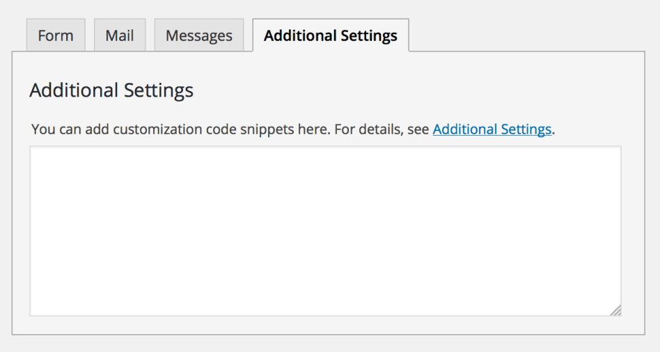

## 管理屏幕

这种接触形式的标题(❶)。这个标题只是一个联系人表单的标签，仅用于管理目的。你可以使用任何你喜欢的标题，例如:“求职申请表”、“表格2014/02/14”等等。

商家的联系形式(❷)。复制此代码并将其粘贴到您想要放置此联系人表单的文章、页面或文本小部件内容中。

您可以保存、复制或删除这个联系人表单(❸)。

### 表单标签

表单编辑字段(❷)。可以使用HTML和表单标签自定义表单内容。该字段中的行中断和空行被自动格式化为
和

HTML标记。

标签生成器(❶)。通过使用这些标记生成器，您可以在不了解它们的情况下生成表单标记。

有关表单标记的更多信息，请参见标记如何工作。

### 邮件选项卡

您可以编辑一个邮件模板，该模板将作为表单提交的结果发送。您可以在这些字段中使用邮件标记。

Mail(2)模板，它是一个附加的邮件模板，可以从主邮件模板中获得不同的内容，也可以使用。

有关更多信息，请参见设置邮件。

### 信息选项卡

您可以编辑用于各种情况的消息，包括“发生验证错误”、“请填写所需字段”等。

注意这里只提供纯文本。在消息字段中不允许使用HTML标记和实体。

有关更多信息，请参见编辑消息。

### 附加的设置选项卡

您可以在这里添加定制代码片段。有关详细信息，请参见附加设置。