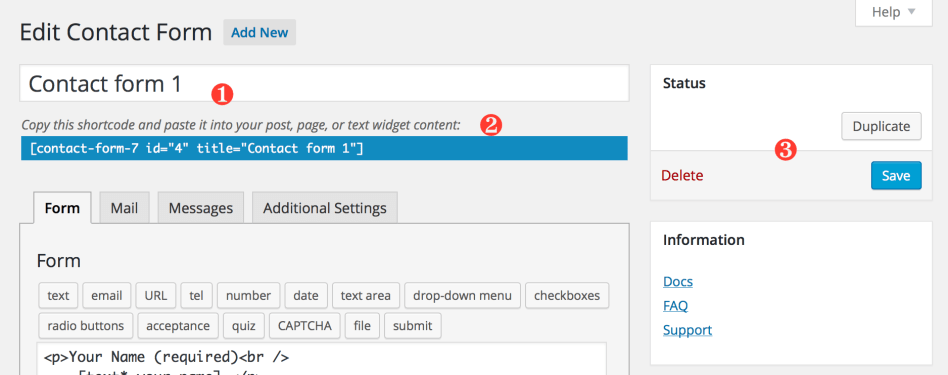
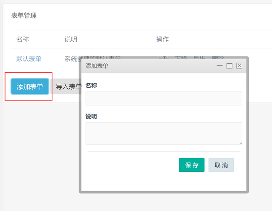

## 表单管理

进入左侧菜单"站点插件" -> "表单" -> "表单管理"中，在此你可以添加、删除以及导入导出表单。

### 添加表单

点击按钮 "添加表单"，进入添加表单界面。

其中名称为表单前台调用标签的标识，用户获取指定表单。你可以使用任何你喜欢的标题，例如:“求职申请表”、“联系我们”等等。

### 删除表单

对于需要删除的表单，可以进入表单管理，在列表中点击 "删除" 按钮将表单删除。

一旦删除表单，此表单的信息以及提交的数据将永久删除且无法恢复，请谨慎操作。