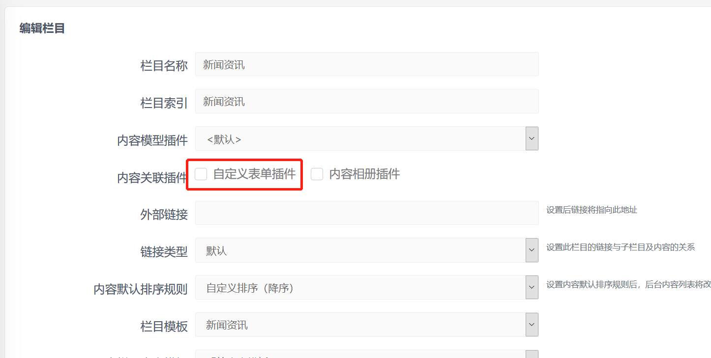
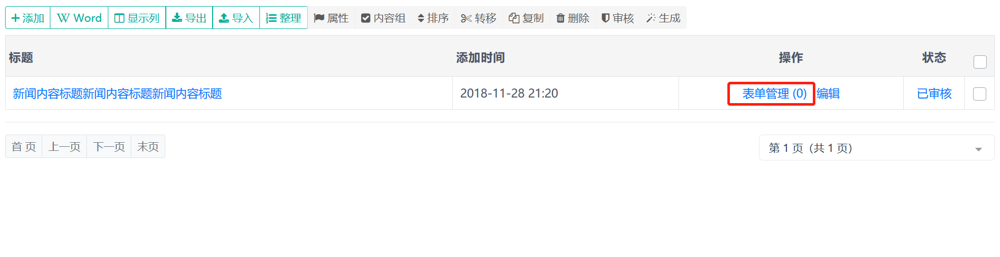
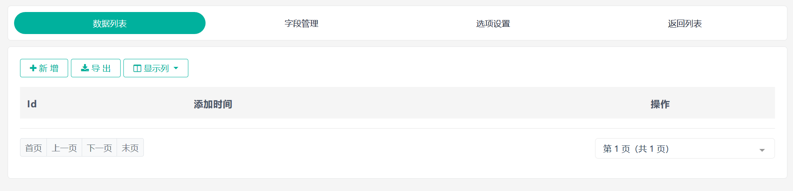
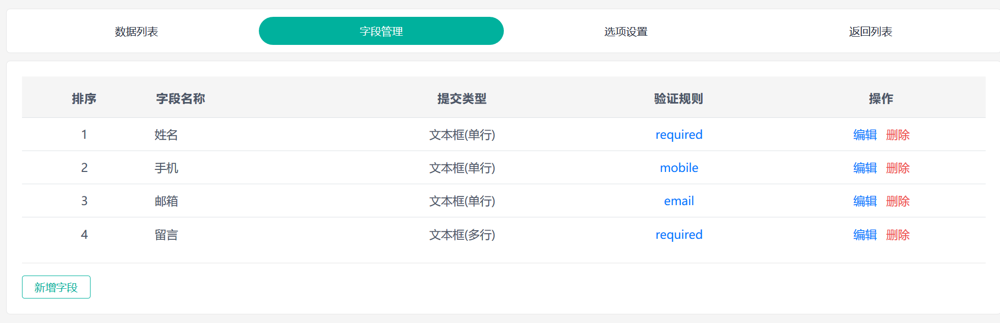

## 内容表单

内容表单和独立表单唯一的区别是表单与内容关联，后台的一篇内容对应一个表单，表单的管理界面在内容列表界面中。

内容表单适合于需要创建大量表单的情况，表单标签需要放到内容模板中，通过内容页面显示。

### 设置栏目

使用内容表单首先需要设置栏目，将栏目与表单插件关联。

进入 SiteServer CMS 后台 **栏目管理** 界面，点击编辑，进入栏目编辑界面：

在内容关联插件中勾选 **自定义表单插件**，点击确定。

### 表单管理

设置好栏目后，进入对应栏目的内容管理界面：

点击表单管理链接，进入表单管理，在此可以管理表单数据，设置表单字段以及进行表单配置。

### 为表单设置字段

进入 **字段管理** 界面：

在字段管理界面中点击 **新增字段** 按钮，进入添加字段界面：

字段名称是字段的标识，可以用中文或英文，表单提交类型是前台表单字段的提交类型，可以根据需要选择。

### 前台页面显示表单

添加完毕字段之后就可以开始在模板中添加表单标签显示表单了。

进入表单插件下的 **表单模板** 界面：

选择一个模板，点击 **获取代码** 链接，能看到表单的代码：

复制代码，将代码放到内容模板中并生成页面，就能在前台看到表单了。