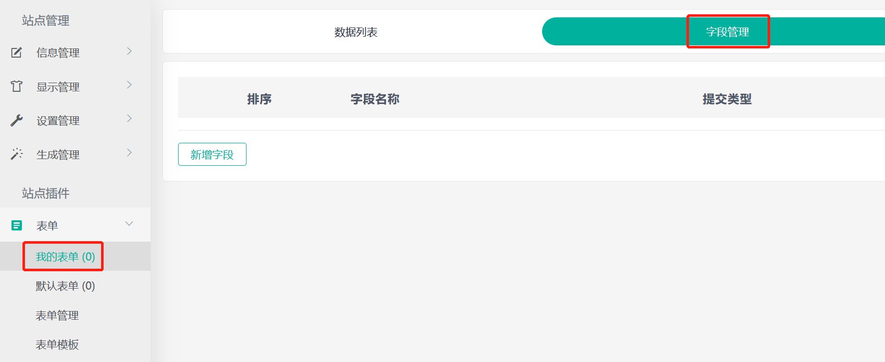
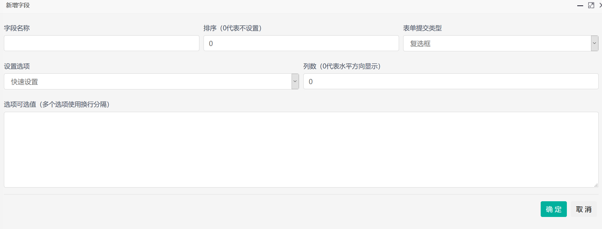
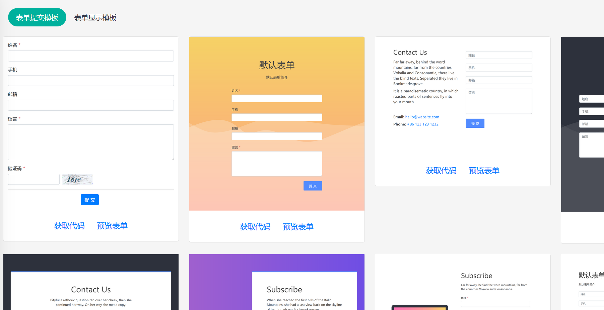
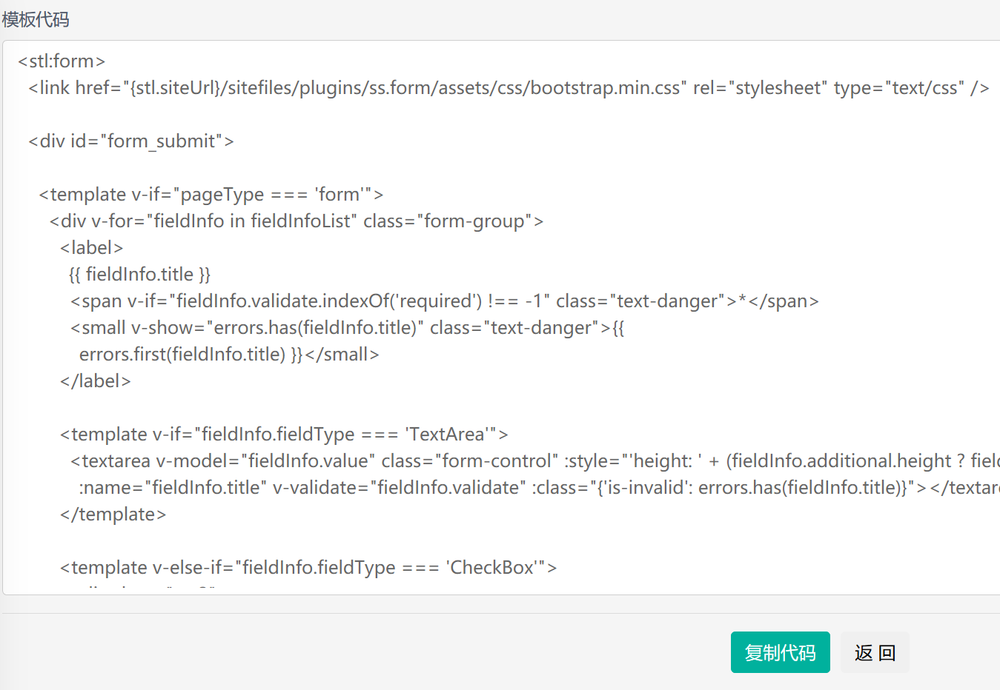

## 独立表单

独立表单是指与内容无关的表单，需要手动创建，创建完毕后需要在模板中添加表单标签。

### 添加独立表单

进入 SiteServer CMS 后台 **表单管理** 界面，在页面底部点击 **新增** 按钮，进入添加表单界面：

**表单名称** 是表单的唯一标识，可以用中文或英文，在模板中调取表单时需要使用；表单简介可以随意填写。

### 为表单设置字段

添加完毕表单后，刷新页面，在左侧菜单中将出现新增的表单名称，点击进入后转到 **字段管理** 界面：

在字段管理界面中点击 **新增字段** 按钮，进入添加字段界面：

字段名称是字段的标识，可以用中文或英文，表单提交类型是前台表单字段的提交类型，可以根据需要选择。

### 前台页面显示表单

添加完毕字段之后就可以开始在模板中添加表单标签显示表单了。

进入表单插件下的 **表单模板** 界面：

选择一个模板，点击 **获取代码** 链接，能看到表单的代码：

复制代码，将第一行`<stl:form>`替换为`<stl:form title="表单名称">`，其中`表单名称`是创建表单时填写的表单名称。

将代码放到模板中并生成页面，就能在前台看到表单了。