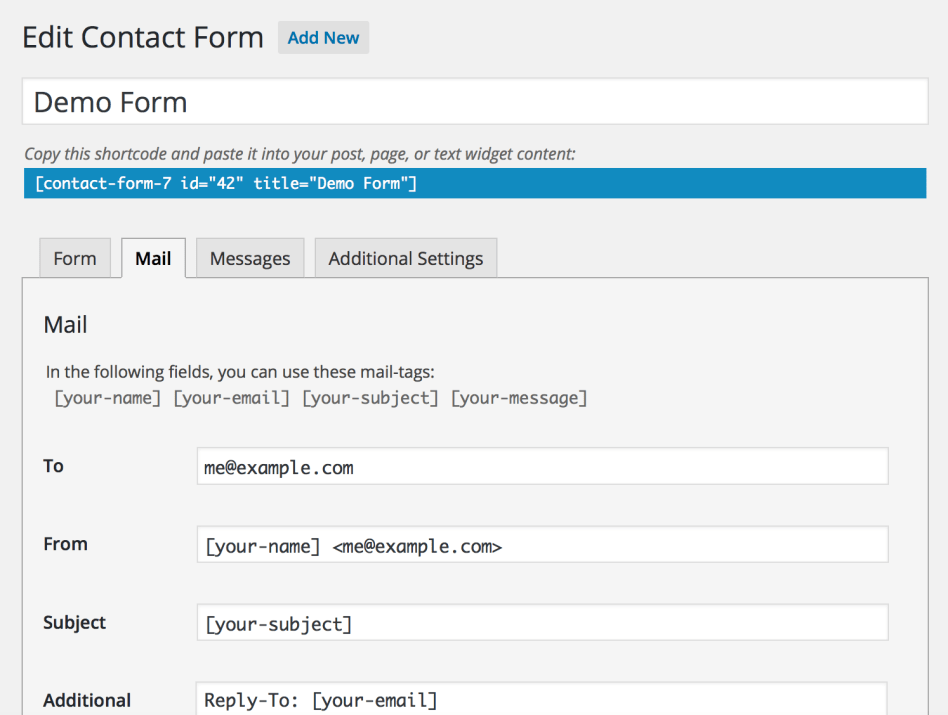

# 设置邮件

联系人表单7允许你非常灵活地编辑邮件模板。你不仅能够编辑消息体，还可以编辑消息头字段。你也可以管理HTML邮件。在本文中，我将向你展示每个字段的设置，并说明如何使用这些设置设置邮件。

## 在邮件标签面板中的字段

你可以在邮件标签面板中编辑邮件模板。

## 基本标题字段(To, From和Subject)

这些是基本的和必要的消息头字段;你可以在这些字段中的任何位置嵌入邮件标记。

## 附加头

你可以在这里插入额外的消息头字段，比如Cc和Bcc。每一行应该有一个字段。你可以在这些字段中的任何位置嵌入邮件标记。

## 消息体

这是消息体;你可以在该字段的任何位置嵌入邮件标记。

如果你从输出框中检查包含空白邮件标记的排除行，那么包含空值的邮件标记的行将被排除在实际邮件输出的消息主体之外。

默认情况下，消息主体使用纯文本。要使用HTML，请检查使用HTML内容类型框。

## 文件附件

如果你将上传的文件附加到此邮件中，请将已上传文件的邮件标记放到该字段中。还可以从服务器(本地文件附件)附加文件。

## 邮件(2)

邮件(2)是一个附加的邮件模板。它经常被用作autoresponder，但你可以用于任何目的。只有当主邮件成功发送时才发送邮件(2)。

## 另请参阅

- [设置邮件的最佳实践](http://www.baidu.com)
- [特殊的邮件标签](http://www.baidu.com)

## 如果你有电子邮件问题

注意:从联系人表单中发送电子邮件对大多数人来说都是完美无缺的，但对每个人来说都不是。

虽然这个插件每天都能成功发送数百万封电子邮件，但有很多问题可以延迟或阻止邮件发送和接收到典型的电子邮件。

需要注意的一点是，发送和接收电子邮件在很大程度上取决于你的SiteServer安装的服务器，以及应该接收邮件的本地计算机的电子邮件配置。

如果你有电子邮件问题，你将需要为你的特定的本地配置调查这个问题。

Buzztone已经对7个电子邮件问题进行了全面详细的解释，以帮助那些在发送和接收来自联系人表单7的邮件时遇到麻烦的人们解决他们的问题。

这篇文章涵盖了以下这些通常会导致电子邮件发送问题的文章(以及一般的SiteServer):

- [主机的问题](http://www.baidu.com)
- [确保使用正确的返回地址。](http://www.baidu.com)
- [你的电子邮件可能被视为垃圾邮件。](http://www.baidu.com)
- [插件或者主题冲突](http://www.baidu.com)
- [Javascript的冲突](http://www.baidu.com)

如果你无法从这个插件发送电子邮件，很有可能你无法从一般的SiteServer发送电子邮件。