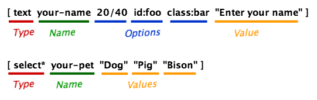

## 标签是如何工作的

联系人表单7允许你编辑你的联系人表单和你的邮件(邮件标题和消息正文)的模板和各种各样的“标记”。在Contact Form 7的术语中，标记指的是在方括号([])中所包含的一种小的已形成的类型字符串。

用于邮件的表单和标记的标记看起来不同，例如，你可以在你的表单中使用[text* your-name]，在你的邮件中使用[你的名字]。它们各自有不同的语法。

### 表单标记语法

表单模板中的标记(“form-tag”)将被替换为一个HTML元素，当它以实际的形式显示时，它表示一个输入字段。表单标记的组件可以分为四部分:类型、名称、选项和值。

类型是最重要的因素，因为它定义了什么类型的HTML元素将替换它自己，以及期望通过它输入什么类型的输入。

名称用于标识输入字段。大多数表单标记都有一个名称，但也有例外。

选项指定行为和外观的细节。选项都是可选的。

在大多数情况下，值用于指定默认值。也有可能，值也可以用于其他目的;这取决于标签的类型。值是可选的。

注意这些部分的顺序很重要。选项不能在名称之前出现，而值不能在选项之前出现。

### 表单标记类型列表

文本字段(文本、文本*、电子邮件、电子邮件*、电话、url、url*、textarea和textarea*)

Number字段(Number, Number *， range和range*)

日期字段(日期和日期*)

复选框、单选按钮和菜单(复选框、复选框*、广播、选择和选择*)

文件上传字段(文件和文件*)

验证码(captchac和captchar)

测试(测试)

验收复选框(验收)

提交按钮(提交)

### Mail-tag语法

邮件模板中的标记(“mail-tag”)要简单得多。邮件标签只有一个字。在大多数情况下，这个单词对应于一个表单标记的名称，它将被替换为通过它的表单输入。

