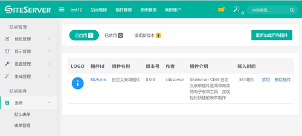

## Text Fields
 
Text input fields are the most common factors of a contact form. As you may know, HTML has two types of elements for text input fields: ```<input type="text">``` for a single-line input; and ```<textarea>``` for multi-line input.

Contact Form 7 provides several types of form tags for representing these two types of HTML elements: text field (text and text*); email field (email and email*); telephone number field (tel and tel*); URL field (url and url*); and textarea (textarea and textarea*). In this article, I will show you detailed information about the usage and semantics of these form tags.

### Text field

Both text and text* are used for single-line input and accept any form of text. The difference between them is that text* connotes a required field. In Contact Form 7’s convention, all types of tags with an asterisk ‘*’ mean that these are required fields.

Available options for text and text*

| First Header  | Second Header | Second Header |
| ------------- | ------------- | ------------- |
| Content Cell  | Content Cell  | Content Cell  |
| Content Cell  | Content Cell  | Content Cell  |

These fields can have a zero or one value, and the value will be used as the default value of the input field.

Example:

```
[text* your-name class:required "John Smith"]
```
 
### Email field
Both email and email* are for single-line input and accept only e-mail addresses. email* is a required field.

Available options for email and email*

| First Header  | Second Header | Second Header |
| ------------- | ------------- | ------------- |
| Content Cell  | Content Cell  | Content Cell  |
| Content Cell  | Content Cell  | Content Cell  |

These fields can have a zero or one value, and the value will be used as the default value of the input field.

Example:

```
[email your-email "example@example.com"]
```

### URL field

Both url and url* are for single-line input and accept only URL. url* is a required field.

Available options for url and url*

| First Header  | Second Header | Second Header |
| ------------- | ------------- | ------------- |
| Content Cell  | Content Cell  | Content Cell  |
| Content Cell  | Content Cell  | Content Cell  |

These fields can have a zero or one value, and the value will be used as the default value of the input field.

Example:

```
[url your-url "http://example.com"]
```

### Demo
Note: This is a demo. This form doesn’t send a mail practically.



View source of above form:

```
Your Name (required)
[text* your-name size:30 maxlength:60]

Your Email (required)
[email* your-email "yourmail@example.com"]

Your Message
[textarea your-message]
default value for a textarea
can be multi-line
like this
[/textarea]

[submit "Send"]
```